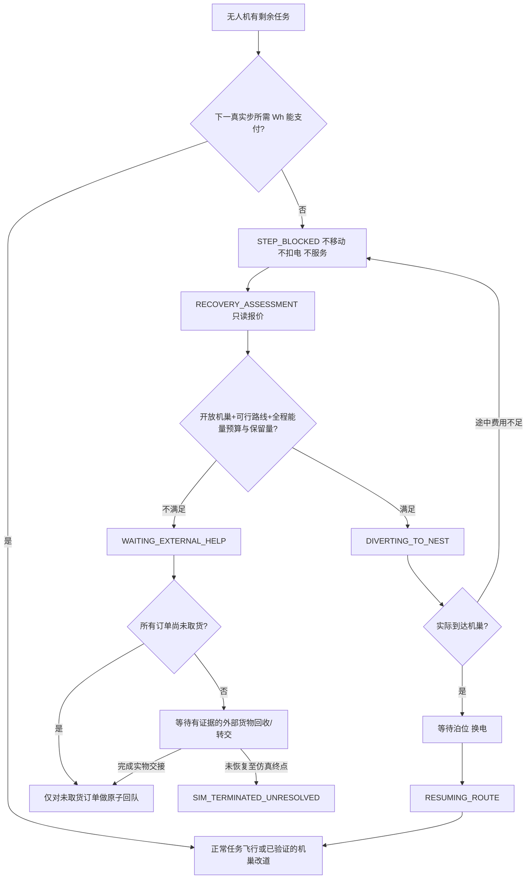

# P2.4a — 欠电应急恢复状态机设计契约（仅设计，不修改生产行为）

> 版本：P2.4a-v1；机器可读契约：`docs/contracts/p2_4a_recovery_state_machine.json`。本阶段的 CI 绿灯只证明**设计文件结构与基线安全测试**符合要求，绝不证明恢复策略已在 `Environment.step()` 实现。

## 1. 审计前提：既有系统的真相

- P2.2 HEAD `97200d2786a5fc775a8e6ea4ca5f95f90b5bcefb`，全套 CI `38037310389` **completed/success**。现实执行器 `frontend/drone.py:363-485` 中，下一步所需 Wh 不足即不移动、不弹航点、不扣电；外部补电后可继续。
- P2.3b 固定旧版 `806d076` 与 P2.2 行为修复 `5bcc6cb` 做强制断电的 30 对/60 回合（`38033007846`）。实验产生 3,594 次/回合左右的**步级阻止尝试**，不等于 3,594 个受阻任务。零电突然耗尽属于**人为故障注入**，不是电池正常衰减。
- 当前 `Drone.update()` 在低电阈值满足时主动选择**最近**充电站并改道，但此前未证明该站能按航段、风/载荷、路径约束及保留电量安全抵达；欠电门会阻止继续飞行但尚无自动恢复策略。
- `Environment.request_drone_charge()` 可以挂起原航线并请求换电，但也未证明剩余 Wh 可覆盖到站全程；现有 `_manage_berths()` 负责泊位与换电时长，不提供飞行可达性证据。
- `Environment.set_drone_out_of_service()` 会回收**所有**剩余任务到原取货点，即使有订单已加载。这只是现行**仿真抽象**，不能当作货物真实返回原取货点的证据。当前 `is_free` 转换兜底还可能触发隐式完成，需要阻止恢复过程制造虚假交付。
- `Task.status` 只有 `pending / assigned / in_progress / completed / failed`，没有持久外部回收或悬置态。P2.4a 的 `unresolved` 只能先作为**单独运行账本分类的拟议字段**，不能声称当前代码已经支持。
- 现有 `Environment.drone_assignments` 中，每笔订单 `load_time=None` 表示**尚无取货航点服务记录**；只有真正消费 `source` 服务航点后才会设置非空 `load_time` 并增加 `onboard_load_kg`。回收时必须逐订单核对该字段，而不是看到任务状态为 `assigned` 就假定货物在原取货点；多单混合链尤其不能统一回滚。
- 现有 `Drone._flight_step_feasible()` 与 `consume_battery()` 重复 Wh 公式；未来优先共享**只读报价函数**，不能简单复用带副作用的扣电函数做预估。

## 2. 规范目标与状态表

| 状态 | 含义 | 现阶段 |
|---|---|---|
| `IDLE` | 可接单；派单前仍需完整航程检查 | 拟议 |
| `MISSION_ACTIVE` | 已分配任务及在途服务航点 | 拟议语义；系统现已有部分字段 |
| `STEP_BLOCKED` | 下一步不够电，位置/路线/货物保持 | P2.2 已有行为证据 |
| `RECOVERY_ASSESSMENT` | 保持静止并评估各机巢可达性 | 未实现 |
| `DIVERTING_TO_NEST` | 完整路线及预算已验证后改飞机巢 | 仅现有粗略最近机巢逻辑 |
| `WAITING_FOR_BERTH` | 真正抵达机巢并登记排队 | 系统现有泊位逻辑 |
| `SWAPPING_BATTERY` | 占用泊位，按完整换电时间补能 | 系统现有换电逻辑 |
| `RESUMING_ROUTE` | 能源恢复且剩余订单航线一致 | P2.2 外部补电恢复已有证据 |
| `WAITING_EXTERNAL_HELP` | 到不了任何可用机巢或突发零电，需外部人员/设备 | 未实现 |
| `TASK_REQUEUE_PENDING` | 满足货权/取货状态核对后可重新派单 | 未实现 |
| `SIM_TERMINATED_UNRESOLVED` | 仿真终止但仍有未解决货物或任务 | 未实现 |

这是**控制/调度状态**，不是飞机空气动力学状态或“空中自动悬停安全”的真实声明；零电后若停在坐标点，仅表示模拟器不再更新位置。

## 3. 关键决策树

状态图只描述待实现策略；P2.4b 必须让每条迁移获得真实的 `Environment.step()` 行为证据。

## 4. 绝对不可违反的不变量

以下属于**硬失败**，不得通过容差放宽、跳过或改统计口径使测试假绿：

1. 欠电不得移动、服务航点弹出、虚构取货交付；`required=debited+shortfall`，拒绝步 `debited=0`。
2. 电池增加仅可由**明确的外部补能事件**或**在真正机巢成功完成定时换电**产生；两者不能记成飞行节能。
3. 停飞或受阻机不应变成调度器可接单无人机；一条任务在 `pending/assigned/completed/failed/unresolved` 语义分区中只占一个位置。
4. 已取货的实物必须记录物理保管人、位置和明确交接事件；不得直接将货物“传送”回原始取货点。
5. 一机多单应支持“已取货＋未取货”混合链；可回队的未取货任务不应释放已取货的货物责任，不能清空 `onboard_load_kg` 冒充卸货。
6. 泊位只在抵达后占用，且占用/释放各一次；关闭的机巢和不可达的机巢不能列为有效目的地。
7. 实际取货和交付必须由真正被 `Drone.update()` 弹出的 `source/dest` 类型服务航点见证，而非几何距离、路程经过或 `is_free` 转换。
8. 不允许“最近机巢即最易到达”作为充分依据；必须将 OSM/禁飞区、风、载荷、路线能耗与返航/应急保留量一起计算。
9. `assigned` 仍是生产默认，`onboard` 仍是 opt-in；不改历史 E0/E1 的冻结实验和任何 P1/P2 原始结果。
10. 反复提交相同回收/重派/换电动作必须幂等（无重复任务、充电、泊位占用或完成事件）。

对应完整机器规则 I01–I14、迁移 T01–T16、场景 A01–A16 保存在 JSON 契约中。

## 5. P2.4b 分段红灯契约（尚未执行）

| 阶段 | 先要取得的真实失败证据 | 最小修复与验收 |
|---|---|---|
| B1 统一能耗报价 | A13：只读报价和实际扣电偏差/公式重复 | 单一报价来源；一致输入下 Wh 匹配；保留原账本接口 |
| B2 派单/改道可行性 | A03/A10：选最近但电量不足、风变后路径不可行 | 不可达必拒绝，仍无免费飞行；保持原路径 |
| B3 受阻状态管理 | A04/A08/A11：零电任务悬空、反复阻塞 | 明确外部救援/未完成分类和受阻时长 |
| B4 货物与订单回收 | A05/A06/A07/A14/A15/A16：货物来源、派单和重复事件不一致 | 未取货可重派；已取货需外部保管交接证据；账本原子/幂等 |
| B5 机巢资源 | A09：泊位资源竞争、关闭站/换电占用异常 | 真实到达后排队；无超额占用或瞬时补能 |

**红灯定义**：在原版 P2.2 的真实 `Drone/Environment/Greedy` 路径中，新编写的严格断言必须真实失败，记录 SHA、seed、输入、日志；随后只在独立实现分支修复，再获得专项绿灯与完整 CI。禁止用 `skip/xfail`、mock 自动补电或降低判据回避。

其中“突然零电时安全迫降”不在当前模型能力内。P2.4b 只能将其标记成**尚待外部干预/仿真未解决**，不能宣称解决了真实航空安全问题。

## 6. 现阶段验收与风险边界

P2.4a 仅新增状态设计文件、机器契约、结构校验测试与 CI；不修改 `frontend/drone.py`、`environment.py`、`task.py`、Greedy、PSO、`simulation.json` 或基准实验结果。结构校验全部通过只表示**设计一致**，不意味着未来场景 A03–A16 已经通过生产测试。

下一轮进入 P2.4b 前，应审查任务货权回收的建模假设，并约定“现场外部介入”作为离散事件的合法输入。
